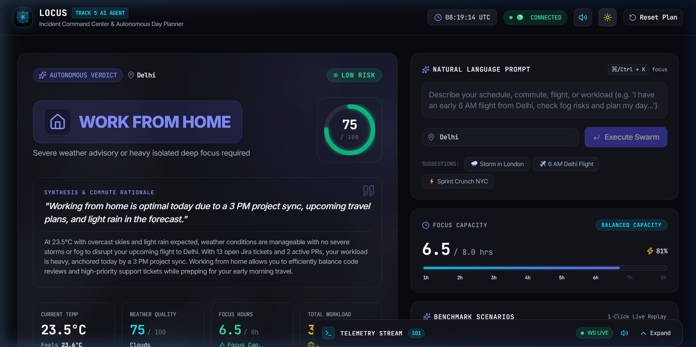
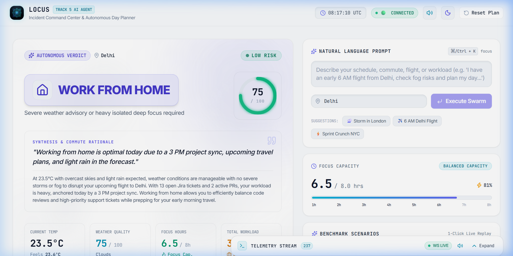
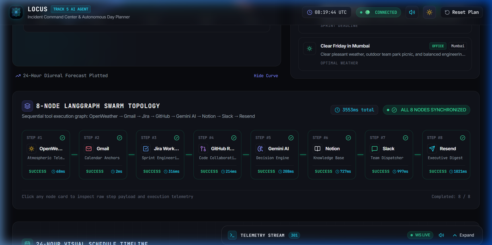
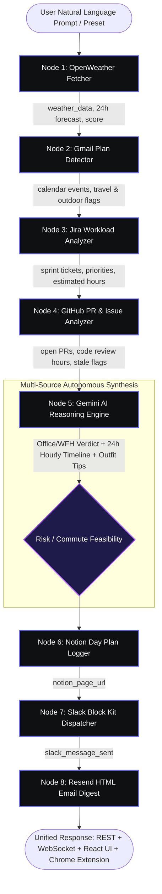

<p align="center">
  
</p>

# ⚡ Locus — Autonomous Incident Command Center & Day Planner

> **🏆 Track 5: AI Real World Agent | Build with Swytchcode Hackathon 2026**  
> An autonomous, context-aware AI agent synthesizing physical real-world atmosphere (**OpenWeather**) with developer engineering workload (**Gmail**, **Jira Cloud**, **GitHub**) into an objective Office vs. WFH verdict, hour-by-hour operational schedule, and multi-channel executive briefings dispatched across **Notion**, **Slack**, and **Resend**.

<p align="center">
  <a href="https://swytchcode.com"></a>
  <a href="https://langchain.com"></a>
  <a href="https://react.dev"></a>
  <a href="https://fastapi.tiangolo.com"></a>
  <a href="https://ai.google.dev"></a>
  <a href="./docs/SHOWCASE_MANUAL.md"></a>
  <a href="./extension/"></a>
</p>

---

## 📸 Executive Incident Command Center

<p align="center">
  
</p>

<p align="center">
  <em>Dark Mode (Obsidian <code>#090a0f</code>): Linear / Raycast-inspired Incident Command Center with dynamic 60fps atmospheric weather canvas, autonomous verdict engine, and live focus capacity gauge.</em>
</p>

<br />

<p align="center">
  
</p>

<p align="center">
  <em>Light Mode (Clean Slate <code>#f8fafc</code>): High-contrast executive dashboard with crisp typography, high-contrast score gauge, and adaptive SVG diurnal temperature curves.</em>
</p>

<br />

<p align="center">
  
</p>

<p align="center">
  <em>8-Node Swarm Topology: Live state-machine pipeline tracking execution status, sub-second tool latencies, and real-time data packets flowing across all 8 nodes.</em>
</p>

---

## 🎯 The Problem & Why Locus Wins

Every morning, knowledge workers face acute decision fatigue across disconnected tools:
1. **Weather & Commute Risks**: Is it raining? Will severe fog delay my morning flight?
2. **Email Calendar Anchors**: Do I have offsite client meetings or travel plans buried in Gmail?
3. **Engineering Sprint Load**: How many high-priority Jira tickets and story points are pending?
4. **Code Review Bottlenecks**: Are there stale GitHub PRs blocking teammates?
5. **Office vs. WFH Dilemma**: Should I commute 90 minutes to the office or stay home for uninterrupted deep focus?

**Locus eliminates this morning chaos in under 3 seconds.** Powered by an 8-node compiled **LangGraph** workflow and **Google Gemini** reasoning, Locus aggregates real-world context, evaluates trade-offs, renders an objective verdict, builds a conflict-free 24-hour schedule, and autonomously delivers executive briefings to **Notion**, **Slack**, and **Resend**.

---

## 🤖 8-Node LangGraph Pipeline

Locus executes an intelligent sequential-parallel pipeline compiled with **LangGraph**:



---

## 🔗 7 Real-World Swytchcode Integrations + AI Reasoning

| Integration | Tool / Endpoint | Role in Day Planning |
|---|---|---|
| 🌦️ **OpenWeather** | `openweather.current.get` | Live conditions, 24h diurnal temperature curve, humidity, commute weather score (0–100) |
| 📬 **Gmail** | `gmail.messages.list` | Scans inbox for flight itineraries (MakeMyTrip, IndiGo), appointments, and outdoor outings |
| 📋 **Atlassian Jira** | `jira.issues.list` | Ingests active sprint backlog (`CCS-13`, `CCS-11`), priority weighting, sprint focus load |
| 🐙 **GitHub** | `github.pullRequests.list` | Reviews open PRs (`#42`, `#43`), flags stale reviews (>2d), review workload estimation |
| 🧠 **Google Gemini** | `gemini-2.5-flash` | Multi-source reasoning engine: Office/WFH verdict, outfit tips, 24h schedule allocation |
| 📓 **Notion** | `notion.pages.create` | Autonomous database logging with formatted callouts, tables, and auto-generated page URLs |
| 💬 **Slack** | `slack.messages.send` | Block Kit broadcast with verdict banners, schedule preview, and clickable Notion button |
| 📧 **Resend** | `resend.email.create` | Responsive HTML executive briefing email delivered straight to user's inbox |

---

## 🧩 Locus Chrome Extension Companion (Manifest V3)

In addition to the Web Command Center, Locus includes a production-ready **Manifest V3 Chrome Extension** (`extension/`):

- **Action Popup HUD (`Alt+L`)**: Glanceable Office vs. WFH verdict, weather score gauge, Pomodoro focus timer, and quick actions in `<150ms`.
- **Side Panel Live Timeline**: Docked 24-hour visual schedule companion with interactive task completion checkboxes.
- **Active Tab Context Scraper**: Automatically detects Jira tickets (`*.atlassian.net`) and GitHub PRs (`github.com`) to plan around the active task.
- **Omnibox Integration**: Type `locus <city or query>` into the Chrome URL bar to trigger autonomous planning directly.
- **Web Audio Sound Cues**: Clean cyber-synthesizer feedback for task completion, state changes, and emergency alerts.
- **Zero-Downtime Standalone Fallback**: Includes deterministic local simulation when running disconnected from backend.

👉 **[Read Chrome Extension Architecture & Setup Guide](./extension/README.md)**

---

## 🎨 Dual-Theme Engine (Dark Obsidian & Light Slate)

Locus features an executive dual-theme engine engineered for maximum visual contrast and accessibility:

- **Obsidian Dark Mode (`#090a0f`)**: Deep cyber-industrial surface, neon cyan/indigo glow accents, and glassmorphic card layers.
- **Crisp Slate Light Mode (`#f8fafc`)**: Crisp executive paper-like aesthetics, bold black/dark slate typography (`#0f172a`), high-contrast score gauges, and subtle border shadows.
- **RGB Channel Triplet Tokens**: Built with CSS variables (`--bg-base-rgb`, `--surface-card-rgb`) coupled with Tailwind's `withOpacity()` helper to prevent opacity-bleed bugs.
- **Zero Layout Shift**: Fixed-width tabular digits (`tabular-nums`) prevent digit jitter during 1000ms clock ticks and live WebSocket streams.

---

## 📁 Repository Structure

```
Locus/
├── backend/                       # Python 3.11+ AI Agent & FastAPI Server
│   ├── src/
│   │   ├── agent.py               # Compiled 8-Node LangGraph StateGraph
│   │   ├── state.py               # TypedDict AgentState schema (38 state attributes)
│   │   ├── config.py              # Centralized environment & Swytchcode manager
│   │   ├── tools.py               # Swytchcode tool loader & execution wrapper
│   │   └── nodes/                 # 8 dedicated workflow nodes:
│   │       ├── weather_fetcher.py # [Node 1] OpenWeather fetcher & scoring
│   │       ├── gmail_reader.py    # [Node 2] Gmail calendar anchor scanner
│   │       ├── jira_workload.py   # [Node 3] Jira sprint ticket analyzer
│   │       ├── github_workload.py # [Node 4] GitHub PR & issue analyzer
│   │       ├── ai_advisor.py      # [Node 5] Gemini AI reasoning engine
│   │       ├── notion_logger.py   # [Node 6] Notion database logger
│   │       ├── slack_notifier.py  # [Node 7] Slack Block Kit dispatcher
│   │       └── email_sender.py    # [Node 8] Resend HTML digest generator
│   ├── server.py                  # Asynchronous FastAPI backend (REST + WebSocket)
│   ├── main.py                    # CLI runner (--demo, --verify, interactive)
│   ├── test_day_planner.py        # 29-test automated backend test suite
│   ├── test_audit.py              # 10-point live REST & WebSocket telemetry audit
│   ├── requirements.txt           # Python dependencies
│   └── README.md                  # Backend documentation
│
├── frontend/                      # React 19 + TypeScript + Vite Command Center
│   ├── src/
│   │   ├── components/            # UI components (DecisionCard, SwarmTopology, Timeline, HUDs)
│   │   ├── context/               # AgentContext (WebSocket) & ThemeContext (Light/Dark)
│   │   ├── services/              # API client, WebSocket listener, RFC 5545 export service
│   │   ├── types/                 # TypeScript interfaces matching backend AgentResponse
│   │   ├── App.tsx                # Main Incident Command Center dashboard
│   │   └── index.css              # Dual-theme design tokens & adaptive scrollbars
│   ├── package.json               # Node dependencies
│   ├── vite.config.ts             # Vite build configuration
│   ├── tailwind.config.js         # Tailwind config with withOpacity helper
│   └── README.md                  # Frontend documentation
│
├── extension/                     # Manifest V3 Chrome Extension Companion
│   ├── src/
│   │   ├── background/            # Background service worker & alarm scheduler
│   │   ├── popup/                 # Action Popup HUD (TypeScript + CSS)
│   │   ├── sidepanel/             # Docked Day Plan Side Panel companion
│   │   ├── content/               # Context scraper for Jira & GitHub tabs
│   │   └── utils/                 # Audio synthesizer, offline simulator, API client
│   ├── public/                    # Manifest V3 JSON, icons, and static assets
│   ├── dist/                      # Pre-compiled unpacked extension ready to load
│   ├── scripts/build.mjs          # Ultra-fast esbuild compilation pipeline
│   └── README.md                  # Extension companion documentation
│
├── docs/                          # Comprehensive Documentation & Assets
│   ├── SHOWCASE_MANUAL.md         # End-to-end showcase manual & 3-minute pitch script
│   ├── PRESENTATION_PITCH_GUIDE.md# Rubric alignment, judging breakdown & talking points
│   ├── beginner_setup_guide.md    # Step-by-step zero-to-hero onboarding guide
│   ├── screenshots/               # High-res screenshots (dark, light, swarm)
│   └── assets/                    # Locus logo and iconography
│
├── START_APP.bat                  # 1-Click Unified Production Launcher (backend + frontend)
├── SHOWCASE_MANUAL.md             # Root showcase manual
├── test_audit.py                  # Root 1-click live system audit script
└── .gitignore                     # Monorepo ignore rules
```

---

## 🚀 Quick Start (1-Click Launch)

### The Fastest Way: Root Unified Launcher
Double-click [`START_APP.bat`](./START_APP.bat) or run from PowerShell:
```powershell
.\START_APP.bat
```
*Automated launch steps performed:*
1. 🧹 Cleans up stale processes holding ports **8000** or **5173**.
2. 🐍 Validates Python virtual environment (`backend/venv/`).
3. 📦 Validates Node.js & frontend dependencies (`frontend/node_modules/`).
4. 🚀 Launches FastAPI Backend on `http://localhost:8000` with WebSocket telemetry.
5. ⚡ Launches React 19 Vite Dev Server on `http://localhost:5173`.
6. 🌐 Automatically opens default browser to the Incident Command Center.

---

## 🧪 Automated Verification Suite (110 / 110 Tests Passed)

Locus features **110 passing automated verification tests** across backend, frontend, RFC 5545 export compliance, and live telemetry:

| Test Command | Scope | Result |
|---|---|---|
| `python test_audit.py` | 10 live system audit checks (REST endpoints, 38-field state schema, WebSocket streaming) | **10 / 10 PASS (100%)** |
| `python test_day_planner.py` | 29 tests covering all 8 nodes, fallbacks, LangGraph compilation, FastAPI TestClient, and CLI | **29 / 29 PASS (100%)** |
| `node verify_frontend_e2e.mjs` | 49 tests verifying production build, bundle sizes, component mounts, and tokens | **49 / 49 PASS (100%)** |
| `npx tsx test_adversarial_exports.ts` | 18 tests verifying RFC 5545 CRLF injection, character escaping, and Unicode fidelity | **18 / 18 PASS (100%)** |
| `node verify_m4_m5.mjs` | 4 tests verifying strict CRLF export delimiters and JSON fidelity | **4 / 4 PASS (100%)** |
| `python -W error -c "import server"` | Zero-deprecation import check | **0 WARNINGS** |
| `npm run build` (frontend) | TypeScript + Vite production compilation | **0 ERRORS (5.43s)** |
| `npm run build` (extension) | Manifest V3 esbuild production compilation | **0 ERRORS (52ms)** |

#### Run Verification Locally:
```powershell
# 1. Live system & WebSocket audit:
.\backend\venv\Scripts\python.exe test_audit.py

# 2. Backend & LangGraph unit/integration suite:
cd backend
.\venv\Scripts\python.exe test_day_planner.py
cd ..

# 3. Frontend production build:
cd frontend
npm run build
cd ..

# 4. Chrome Extension companion build:
cd extension
npm run build
cd ..
```

---

## 🏆 Hackathon Showcase & Judge Pitch

For our complete **3-minute live demonstration script**, judge rubric alignment, curl/PowerShell verification commands, and talking points:
👉 **[Read the Complete Showcase Manual](./SHOWCASE_MANUAL.md)**  
👉 **[Read the Presentation & Pitch Guide](./docs/PRESENTATION_PITCH_GUIDE.md)**

---

## ⚖️ License
MIT License. Built with ❤️ for the **Build with Swytchcode Hackathon 2026**.
