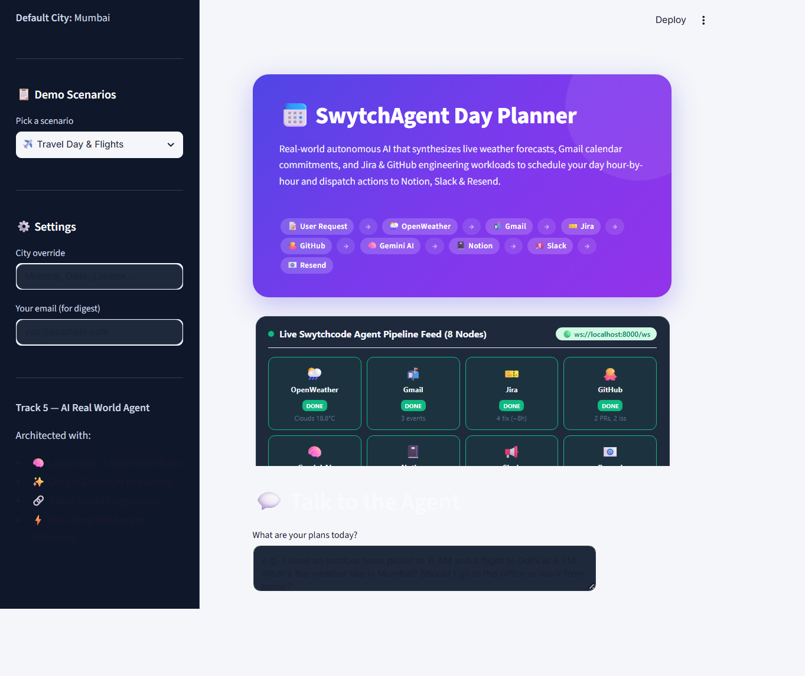
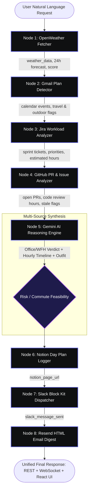

# ⚡ SwytchAgent Day Planner v2.0 — Autonomous Incident Command Center

> **🏆 Track 5: AI Real World Agent | Build with Swytchcode Hackathon 2026**  
> An autonomous, context-aware AI agent synthesizing real-world conditions (**OpenWeather**) with developer work context (**Gmail**, **Jira**, **GitHub**) to estimate workloads, recommend Office vs. WFH decisions, formulate hour-by-hour schedules, and automate executive briefings across **Notion**, **Slack**, and **Resend**.

[](https://swytchcode.com)
[](https://langchain.com)
[](https://react.dev)
[](https://fastapi.tiangolo.com)
[](https://ai.google.dev)
[](./docs/SHOWCASE_MANUAL.md)

---

## 📸 Incident Command Center UI



*Linear / Raycast dark-mode interface featuring dynamic 60fps atmospheric weather canvas, 8-node live swarm topology visualizer, interactive 24h schedule timeline, dual Jira/GitHub workload matrix, and 1-click RFC 5545 calendar export.*

---

## 🎯 The Problem & Our Solution

Every morning, knowledge workers face fragmented decision fatigue across half a dozen tabs:
- *What's the weather and commute risk?*
- *Do I have flights or offsite meetings in my email?*
- *How many Jira sprint tickets and story points are on my plate?*
- *Are there GitHub pull requests blocking teammates that need code reviews?*
- *Should I commute to the office today or stay productive at home?*

**SwytchAgent 2.0** turns this chaos into clarity before you take your first sip of coffee. Powered by an 8-node compiled LangGraph pipeline and Google Gemini reasoning, it autonomously fetches all inputs, balances meetings against deep work, renders an objective Office/WFH verdict, generates a conflict-free 24-hour schedule, and automatically dispatches briefings to your team.

---

## 🤖 8-Node LangGraph Pipeline

SwytchAgent executes an intelligent sequential-parallel pipeline compiled with **LangGraph**:



---

## 🔗 7 Real-World Integrations + AI Reasoning

| Integration | Tool / Endpoint | Role in Day Planning |
|---|---|---|
| 🌦️ **OpenWeather** | `openweather.current.get` | Live conditions, 24h temperature curve, humidity, commute weather score (0-100) |
| 📬 **Gmail** | `gmail.messages.list` | Inbox scanning for flight bookings (MakeMyTrip), appointments, and outdoor outings |
| 📋 **Jira** | `jira.issues.list` | Assigned sprint tickets (PROJ-101..104), priority weighting, focus hour calculation |
| 🐙 **GitHub** | `github.pullRequests.list` | Review obligations (PR #42, #43), stale review flags (>2d), review workload estimation |
| 🧠 **Google Gemini** | `gemini-2.5-flash` | Multi-source reasoning engine: Office/WFH verdict, outfit tips, 24h schedule slots |
| 📓 **Notion** | `notion.pages.create` | Automated executive Day Plan database logging with `≤1900` character block chunking |
| 💬 **Slack** | `slack.messages.send` | Rich Block Kit broadcast with decision banners, timeline blocks, and Notion CTA |
| 📧 **Resend** | `resend.email.create` | Responsive HTML daily briefing email with dynamic weather gradient delivered to inbox |

---

## 📁 Repository Structure

```
SwytchAgent2.0/
├── backend/                       # Python 3.11+ AI Agent & FastAPI Server
│   ├── src/
│   │   ├── agent.py               # Compiled 8-Node LangGraph StateGraph
│   │   ├── state.py               # TypedDict AgentState schema
│   │   ├── config.py              # Centralized configuration & environment manager
│   │   ├── tools.py               # Swytchcode tool loader & execution wrapper
│   │   └── nodes/                 # 8 dedicated workflow nodes:
│   │       ├── weather_fetcher.py # [1] OpenWeather fetcher & scoring
│   │       ├── gmail_reader.py    # [2] Gmail calendar anchor scanner
│   │       ├── jira_workload.py   # [3] Jira sprint ticket analyzer
│   │       ├── github_workload.py # [4] GitHub PR & issue workload analyzer
│   │       ├── ai_advisor.py      # [5] Gemini AI reasoning engine
│   │       ├── notion_logger.py   # [6] Notion executive database logger
│   │       ├── slack_notifier.py  # [7] Slack Block Kit dispatcher
│   │       └── email_sender.py    # [8] Resend HTML digest generator
│   ├── dashboard/
│   │   └── app.py                 # Streamlit interactive dashboard (legacy UI)
│   ├── server.py                  # Modern FastAPI backend (lifespan, REST + WebSocket)
│   ├── main.py                    # CLI runner (--demo, --verify, interactive)
│   ├── test_day_planner.py        # 29-test automated backend verification suite
│   ├── test_audit.py              # 10-point live REST & WebSocket telemetry audit
│   ├── requirements.txt           # Python dependencies
│   ├── .env.example               # Sanitized environment template
│   └── README.md                  # Backend technical documentation
│
├── frontend/                      # React 19 + TypeScript + Vite Command Center
│   ├── src/
│   │   ├── components/            # UI components (DecisionCard, SwarmTopology, Timeline, HUDs)
│   │   ├── context/               # AgentContext with real-time WebSocket state management
│   │   ├── services/              # API client, WebSocket listener, RFC 5545 export generator
│   │   ├── types/                 # TypeScript interfaces matching backend AgentResponse
│   │   ├── App.tsx                # Main Incident Command Center dashboard
│   │   └── main.tsx               # Application root
│   ├── verify_frontend_e2e.mjs    # 49-test production build & component verification
│   ├── test_adversarial_exports.ts# 18-test RFC 5545 CRLF & Unicode export challenger
│   ├── verify_m4_m5.mjs           # 4-test CRLF delimiter & escaping validator
│   ├── package.json               # Node dependencies
│   ├── vite.config.ts             # Vite configuration
│   ├── tailwind.config.js         # Design system tokens & surface ladder
│   └── README.md                  # Frontend Command Center documentation
│
├── docs/                          # Comprehensive Documentation & Showcase Assets
│   ├── SHOWCASE_MANUAL.md         # End-to-end showcase manual & 3-minute pitch script
│   ├── beginner_setup_guide.md    # Step-by-step setup guide for judges & developers
│   └── screenshots/
│       └── localhost.png          # High-resolution Command Center screenshot
│
├── START_APP.bat                  # 1-Click Unified Production Launcher (backend + frontend)
├── SHOWCASE_MANUAL.md             # Root showcase manual reference
├── test_audit.py                  # Root 1-click live system audit script
└── .gitignore                     # Unified monorepo .gitignore
```

---

## 🚀 Quick Start (1-Click Launch)

### The Fastest Way: Root Unified Launcher
Double-click [`START_APP.bat`](./START_APP.bat) or run from PowerShell:
```powershell
.\START_APP.bat
```
*Automated launch steps performed:*
1. 🧹 Cleans up stale processes holding ports **8000** or **5173**.
2. 🐍 Validates Python virtual environment (`backend/venv/`).
3. 📦 Validates Node.js & frontend dependencies (`frontend/node_modules/`).
4. 🚀 Launches FastAPI Backend on `http://localhost:8000` with WebSocket telemetry.
5. ⚡ Launches React 19 Vite Dev Server on `http://localhost:5173`.
6. 🌐 Automatically opens your default browser to the Incident Command Center.

---

## 🧪 Automated Verification Suite (110 / 110 Tests Passed)

SwytchAgent 2.0 features **110 passing automated verification tests** across backend, frontend, RFC 5545 export compliance, and live telemetry:

| Test Command | Scope | Result |
|---|---|---|
| `python test_audit.py` | 10 live system audit checks (REST endpoints, 38-field state schema, WebSocket streaming) | **10 / 10 PASS (100%)** |
| `python test_day_planner.py` | 29 tests covering all 8 nodes, fallbacks, LangGraph compilation, FastAPI TestClient, and CLI | **29 / 29 PASS (100%)** |
| `node verify_frontend_e2e.mjs` | 49 tests verifying production build, bundle sizes, component mounts, and tokens | **49 / 49 PASS (100%)** |
| `npx tsx test_adversarial_exports.ts` | 18 tests verifying RFC 5545 CRLF injection, character escaping, and Unicode fidelity | **18 / 18 PASS (100%)** |
| `node verify_m4_m5.mjs` | 4 tests verifying strict CRLF export delimiters and JSON fidelity | **4 / 4 PASS (100%)** |
| `python -W error -c "import server"` | Zero-deprecation import check | **0 WARNINGS** |
| `npm run build` | TypeScript + Vite production compilation | **0 ERRORS (2.33s)** |

#### Run All Tests:
```powershell
# 1. Live system & WebSocket audit:
.\backend\venv\Scripts\python.exe test_audit.py

# 2. Backend & LangGraph unit/integration suite:
cd backend
.\venv\Scripts\python.exe test_day_planner.py
cd ..

# 3. Frontend production & export compliance suites:
cd frontend
node verify_frontend_e2e.mjs
npx tsx test_adversarial_exports.ts
cd ..
```

---

## 🏆 Hackathon Showcase & Judge Pitch

For our complete **3-minute live demonstration script**, curl/PowerShell verification commands, and judge showcase guide:
👉 **[Read the Complete Showcase Manual](./docs/SHOWCASE_MANUAL.md)**

---

## ⚖️ License
MIT License. Built with ❤️ for the **Build with Swytchcode Hackathon 2026**.
