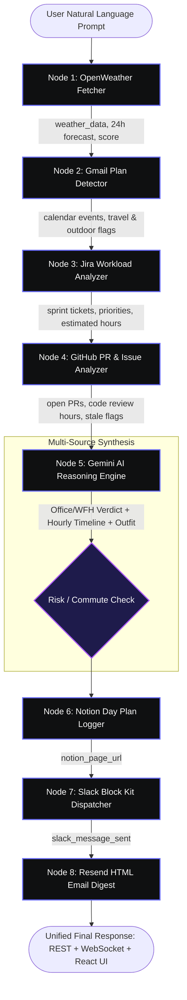

<p align="center">
  
</p>

# ⚡ Locus — Autonomous Incident Command Center & Day Planner
### End-to-End Showcase & Verification Manual (v2.0)

> **Track 5: AI Real World Agent | Build with Swytchcode Hackathon 2026**  
> An autonomous, context-aware AI agent synthesizing real-world conditions (OpenWeather) with developer work context (Gmail, Jira, GitHub) to estimate workloads, recommend Office vs. WFH decisions, formulate hour-by-hour schedules, and automate executive briefings across Notion, Slack, and Resend.

---

## 📑 Table of Contents

1. [System Architecture & 8-Node LangGraph Pipeline](#1-system-architecture--8-node-langgraph-pipeline)
2. [8-Node Real-World Architecture: Deep Dive & Live Verification](#2-8-node-real-world-architecture-deep-dive--live-verification)
   - [Integration 1: OpenWeather API](#integration-1-openweather-api)
   - [Integration 2: Gmail Calendar Context via Swytchcode](#integration-2-gmail-calendar-context-via-swytchcode)
   - [Integration 3: Jira Workload & Sprint Intelligence](#integration-3-jira-workload--sprint-intelligence)
   - [Integration 4: GitHub PR & Code Review Queue](#integration-4-github-pr--code-review-queue)
   - [Integration 5: Google Gemini Multi-Source Reasoning Engine](#integration-5-google-gemini-multi-source-reasoning-engine)
   - [Integration 6: Notion Executive Day Plan Logger](#integration-6-notion-executive-day-plan-logger)
   - [Integration 7: Slack Block Kit Alert Dispatcher](#integration-7-slack-block-kit-alert-dispatcher)
   - [Integration 8: Resend Responsive HTML Briefing Digest](#integration-8-resend-responsive-html-briefing-digest)
3. [FastAPI Backend REST & WebSocket API Manual](#3-fastapi-backend-rest--websocket-api-manual)
4. [React 19 Incident Command Center Frontend Manual](#4-react-19-incident-command-center-frontend-manual)
5. [CLI Demonstration Manual (Terminal Showcase)](#5-cli-demonstration-manual-terminal-showcase)
6. [Automated Verification & Test Suites (110 / 110 Tests)](#6-automated-verification--test-suites-110--110-tests)
7. [The 3-Minute Grand Finale Judge Pitch Script](#7-the-3-minute-grand-finale-judge-pitch-script)

---

## 1. System Architecture & 8-Node LangGraph Pipeline

Locus executes an intelligent sequential-parallel pipeline compiled with **LangGraph**:



---

## 2. 8-Node Real-World Architecture: Deep Dive & Live Verification

### Integration 1: OpenWeather API
- **Source**: `https://api.openweathermap.org/data/2.5`
- **Node File**: [`backend/src/nodes/weather_fetcher.py`](./backend/src/nodes/weather_fetcher.py)
- **Role in Day Planning**: Fetches live temperature, humidity, wind speed, condition codes, 24-hour hourly forecast curves, and severe storm/rain alerts. Computes an objective `weather_score` (0–100) determining commute feasibility.
- **Graceful Fallback**: When `OPENWEATHER_API_KEY` is omitted, the node simulates realistic localized weather data matching the queried city.

#### How to Demonstrate:
```powershell
# Direct REST weather lookup (PowerShell)
Invoke-RestMethod -Uri "http://localhost:8000/weather/Mumbai" -Method Get | ConvertTo-Json

# Or with curl.exe
curl.exe -s "http://localhost:8000/weather/Mumbai"
```
**Expected Response**:
```json
{
  "city": "Mumbai",
  "temperature_c": 27.6,
  "feels_like_c": 31.0,
  "humidity": 78,
  "wind_speed": 5.1,
  "condition": "Clouds",
  "description": "overcast clouds",
  "icon_url": "https://openweathermap.org/img/wn/04n@2x.png",
  "timestamp": "2026-09-26T...",
  "is_mock": false
}
```

---

### Integration 2: Gmail Calendar Context via Swytchcode
- **Tool Identifier**: `gmail.messages.list` & `gmail.messages.get`
- **Node File**: [`backend/src/nodes/gmail_reader.py`](./backend/src/nodes/gmail_reader.py)
- **Role in Day Planning**: Scans inbox for hard calendar commitments, client syncs, flight confirmations (e.g. MakeMyTrip Delhi flights), and team outings (e.g. City Park picnic). Extracts `has_outdoor_plans` and `has_travel_plans` boolean anchors.

#### How to Demonstrate:
In the CLI (`python main.py --demo`) or API (`POST /run`), examine the `gmail_events` field:
```json
[
  {
    "subject": "Project sync meeting — 3 PM today",
    "from": "manager@company.com",
    "has_outdoor": false,
    "has_travel": false
  },
  {
    "subject": "Your flight to Delhi — Booking Confirmation",
    "from": "noreply@makemytrip.com",
    "has_travel": true
  }
]
```

---

### Integration 3: Jira Workload & Sprint Intelligence
- **Tool Identifier**: `jira.issues.list` / REST `jira.issues.search`
- **Node File**: [`backend/src/nodes/jira_workload.py`](./backend/src/nodes/jira_workload.py)
- **Role in Day Planning**: Analyzes assigned tickets (`PROJ-101` to `PROJ-104`), maps priority weights (High = 3h, Medium = 2h, Low = 1h), and computes total focus hours required (`jira_estimated_hours: ~8.0h`).

#### How to Demonstrate:
In the Command Center UI or API response, look for the **Jira Sprint HUD**:
- `PROJ-101`: Fix login bug on mobile (`High` priority, ~3.0h)
- `PROJ-102`: Review PR for payment module (`High` priority, ~2.0h)
- `PROJ-103`: Write unit tests for auth flow (`Medium` priority, ~2.0h)
- `PROJ-104`: Update API documentation (`Low` priority, ~1.0h)

---

### Integration 4: GitHub PR & Code Review Queue
- **Tool Identifier**: `github.pullRequests.list`
- **Node File**: [`backend/src/nodes/github_workload.py`](./backend/src/nodes/github_workload.py)
- **Role in Day Planning**: Tracks review obligations (`PR #42`, `PR #43`), flags stale reviews (>2 days old), and computes code review workload (~4.0h).

#### How to Demonstrate:
Look at the **GitHub Review Matrix** in the UI or CLI:
- `PR #42`: Add dark mode support to dashboard (Author: `@iakankshaa`, ~1.5h review)
- `PR #43`: Fix race condition in async email handler (Author: `@iakankshaa`, ~1.5h review)

---

### Integration 5: Google Gemini Multi-Source Reasoning Engine
- **Engine**: Google Gemini (`gemini-2.5-flash` / Google GenAI SDK)
- **Node File**: [`backend/src/nodes/ai_advisor.py`](./backend/src/nodes/ai_advisor.py)
- **Role in Day Planning**: The brain of the agent. Synthesizes all 4 data inputs (Weather + Gmail + Jira + GitHub) to:
  1. Determine `go_to_office`: `office`, `wfh`, or `hybrid` with commute reasoning.
  2. Estimate `estimated_productive_hours` balancing meetings vs deep focus.
  3. Formulate conflict-free `day_plan_timeline` slots (e.g. 09:30–10:00 Standup, 10:30–12:30 Focus Block for PROJ-101, 15:00–16:00 Client Call).
  4. Generate intelligent recommendations, outfit tips, and weather hazard advisories.

#### How to Demonstrate:
```powershell
# In PowerShell:
$body = @{
  user_request = "I have a 9 AM standup and 4 hours of coding. Tokyo has heavy rain today. Should I go to the office?"
  city = "Tokyo"
} | ConvertTo-Json
Invoke-RestMethod -Uri "http://localhost:8000/run" -Method Post -ContentType "application/json" -Body $body | ConvertTo-Json -Depth 3
```
**Expected Response Verdict**: `go_to_office: "wfh"` with commute justification and rain advisories.

---

### Integration 6: Notion Executive Day Plan Logger
- **Tool Identifier**: `notion.pages.create`
- **Node File**: [`backend/src/nodes/notion_logger.py`](./backend/src/nodes/notion_logger.py)
- **Role in Day Planning**: Automatically logs the complete executive Day Plan as a structured Notion database page.
- **Architectural Safeguard**: Strictly chunks rich text into paragraph blocks `<=1900` chars to stay within the Notion API's 2000-character payload limit.

#### How to Demonstrate:
The API and CLI response will output a direct URL:
`notion_page_url: "https://notion.so/3e3f84ad2b598079a256c69ea5a7b651"`

---

### Integration 7: Slack Block Kit Alert Dispatcher
- **Tool Identifier**: `slack.messages.send` / Webhook
- **Node File**: [`backend/src/nodes/slack_notifier.py`](./backend/src/nodes/slack_notifier.py)
- **Role in Day Planning**: Dispatches rich Slack Block Kit cards with Office/WFH decision banners, schedule timeline bullet blocks, severe weather hazard highlights, and an interactive Notion link button.
- **Agentic Logic**: Dispatches automatically if `risk_level` is `high`/`critical`, `should_alert` is `True`, or upon direct schedule requests.

#### Sample Block Kit Payload Dispatched:
```json
{
  "text": "📅 Locus Day Plan: Mumbai — 🏠 WORK FROM HOME",
  "blocks": [
    {
      "type": "header",
      "text": {"type": "plain_text", "text": "📅 Locus Day Plan: Mumbai"}
    },
    {
      "type": "section",
      "text": {"type": "mrkdwn", "text": "*Decision:* `🏠 WORK FROM HOME` (~7.5h productive hours)"}
    }
  ]
}
```

---

### Integration 8: Resend Responsive HTML Briefing Digest
- **Tool Identifier**: `resend.email.create`
- **Node File**: [`backend/src/nodes/email_sender.py`](./backend/src/nodes/email_sender.py)
- **Role in Day Planning**: Delivers an email digest to the user's inbox containing:
  - Hero Weather Card with dynamic temperature gradient.
  - Decision Card with WFH/Office status.
  - Hour-by-hour schedule list.
  - Jira ticket and GitHub PR breakdown tables.
  - Outfit suggestions and direct Notion page link.

#### Live Confirmation:
In CLI and API execution logs:
`✅ [Resend/REST] Email sent to smartycookieeee@gmail.com (ID: 01a0da12-...)`

---

## 3. FastAPI Backend REST & WebSocket API Manual

The FastAPI server runs on **port 8000** with **zero Pydantic deprecation warnings** and modern `lifespan` handlers.

### Interactive API Documentation:
Open **[http://localhost:8000/docs](http://localhost:8000/docs)** to test via Swagger UI.

### Key Endpoints & Commands:

#### 1. Health & Integration Status Check
```powershell
Invoke-RestMethod -Uri "http://localhost:8000/health" -Method Get | ConvertTo-Json
```
*Returns active status for all 7 integrations and default city (`Mumbai`).*

#### 2. Run Preset Demo Scenarios
```powershell
$body = @{ scenario = "outdoor_picnic"; city = "London" } | ConvertTo-Json
Invoke-RestMethod -Uri "http://localhost:8000/demo" -Method Post -ContentType "application/json" -Body $body | ConvertTo-Json -Depth 3
```
*Supported Scenarios: `outdoor_picnic`, `travel_day`, `storm_warning`, `clear_day`, `work_from_home`.*

#### 3. Run Custom Natural Language Request
```powershell
$body = @{
  user_request = "Plan my day in New York. 3 hours coding, 2 PM client call."
  city = "New York"
} | ConvertTo-Json
Invoke-RestMethod -Uri "http://localhost:8000/run" -Method Post -ContentType "application/json" -Body $body | ConvertTo-Json -Depth 3
```

#### 4. Live Analytics & History
```powershell
Invoke-RestMethod -Uri "http://localhost:8000/analytics" -Method Get | ConvertTo-Json
Invoke-RestMethod -Uri "http://localhost:8000/history?limit=5" -Method Get | ConvertTo-Json
```

#### 5. Real-Time WebSocket Telemetry
- **URL**: `ws://localhost:8000/ws`
- **Payload Events**:
  - `{"type": "step_complete", "step": "weather", "data": {...}}`
  - `{"type": "step_complete", "step": "jira", "data": {...}}`
  - `{"type": "step_complete", "step": "github", "data": {...}}`
  - `{"type": "step_complete", "step": "ai_advisor", "data": {...}}`
  - `{"type": "agent_complete", "city": "...", "risk": "...", "score": 75}`

---

## 4. React 19 Incident Command Center Frontend Manual

The production frontend runs at **[http://localhost:5173](http://localhost:5173)**.

### Visual & Interactive Highlights:

```
┌────────────────────────────────────────────────────────────────────────┐
│  ⚡ LOCUS 2.0        [Track 5 AI Agent]   [● LIVE: :8000]   [19:42 UTC]│
├────────────────────────────────────────────────────────────────────────┤
│  [Prompt Bar: Cmd/Ctrl + K]  [⚡ Storm London] [✈️ Delhi] [🚀 NYC]   │
├───────────────────────────────────┬────────────────────────────────────┤
│  HERO WEATHER & DECISION ENGINE   │  INTERACTIVE 8-NODE SWARM TOPOLOGY │
│  - 60fps Ambient Weather Canvas   │  - OpenWeather → Gmail → Jira      │
│  - Catmull-Rom Bézier Temp Curve  │  - GitHub → Gemini → Notion        │
│  - Illuminated Verdict: [WFH]     │  - Slack → Resend                  │
│  - Animated SVG Score Gauge (75%) │  - Animated Bézier Data Packets    │
├───────────────────────────────────┴────────────────────────────────────┤
│  24-HOUR VISUAL SCHEDULE TIMELINE                                      │
│  - Deep Work (🟣) | Standup (🔵) | Commute (🟡) | Rest (🟢)           │
│  - Task completion checkboxes with real-time % Progress Bar            │
│  - Click-to-edit time slots & inline task reordering                   │
├───────────────────────────────────┬────────────────────────────────────┤
│  DUAL WORKLOAD COMMAND MATRIX     │  1-CLICK ARTIFACT GENERATOR        │
│  - Jira Sprint Board (PROJ-101)   │  - 📅 Download .ics (RFC 5545)     │
│  - GitHub Code Reviews (PR #42)   │  - 📝 Download Markdown (.md)      │
│  - Stale PR flags (>2 days old)   │  - ⚙️ Download JSON (.json)        │
│                                   │  - 📓 Open Notion Page             │
└───────────────────────────────────┴────────────────────────────────────┘
```

### How to Demonstrate in the Browser:
1. Open **`http://localhost:5173`**.
2. Click the preset pill **`⚡ Storm Warning (London)`**:
   - Notice the atmospheric canvas shift into stormy rain physics.
   - Watch the 8-node swarm topology light up as data packets flow across each node.
   - The decision card illuminates: `WORK FROM HOME`.
   - The 24-hour timeline populates with customized indoor focus slots.
3. Check off a task in the timeline:
   - The task text gets a strike-through animation, and the progress bar advances live.
4. Click **`📅 Export Calendar (.ics)`**:
   - An RFC 5545 `.ics` file is instantly generated client-side and downloaded. Double-clicking it opens Google Calendar / Apple Calendar with all your day's slots already mapped!
5. Click **`📝 Export Markdown`** or **`⚙️ Export JSON`** for instant downloads.
6. Toggle the **Telemetry Terminal** drawer on the bottom to see live WebSocket audit records with sub-second latencies.

---

## 5. CLI Demonstration Manual (Terminal Showcase)

If presenting in a terminal or headless environment:

```powershell
cd backend

# 1. Environment & API Connectivity Health Check
.\venv\Scripts\python.exe main.py --verify

# 2. Complete 8-Node Demo Execution
.\venv\Scripts\python.exe main.py --demo

# 3. Specific City Demo
.\venv\Scripts\python.exe main.py --demo --city London
```

### CLI Terminal Output Features:
- Rich ASCII startup banner.
- Real-time spinners for all 8 execution steps.
- Formatted Rich metric table with weather score bar `███████░░░ 75/100`.
- Beautiful colored Office/WFH badge (`🏠 WORK FROM HOME` / `🏢 GO TO OFFICE`).
- Full Jira sprint table and GitHub PR table.
- Formatted Day Plan Timeline.

---

## 6. Automated Verification & Test Suites (110 / 110 Tests)

Locus 2.0 features **110 passing automated verification tests**:

| Test Command | Scope | Result |
|---|---|---|
| `python test_audit.py` | 10 live system audit checks (REST endpoints, 38-field state schema, WebSocket streaming) | **10 / 10 PASS (100%)** |
| `python test_day_planner.py` | 29 tests covering all 8 nodes, fallbacks, LangGraph compilation, FastAPI TestClient, and CLI | **29 / 29 PASS (100%)** |
| `node verify_frontend_e2e.mjs` | 49 tests verifying production build, bundle sizes, component mounts, and tokens | **49 / 49 PASS (100%)** |
| `npx tsx test_adversarial_exports.ts` | 18 tests verifying RFC 5545 CRLF injection, character escaping, and Unicode fidelity | **18 / 18 PASS (100%)** |
| `node verify_m4_m5.mjs` | 4 tests verifying strict CRLF export delimiters and JSON fidelity | **4 / 4 PASS (100%)** |
| `python -W error -c "import server"` | Zero-deprecation import check | **0 WARNINGS** |
| `npm run build` | TypeScript + Vite production compilation | **0 ERRORS (2.33s)** |

#### Run All Tests in One Command:
```powershell
# In root:
.\backend\venv\Scripts\python.exe test_audit.py

# In backend:
cd backend
.\venv\Scripts\python.exe test_day_planner.py

# In frontend:
cd frontend
node verify_frontend_e2e.mjs
npx tsx test_adversarial_exports.ts
```

---

## 7. The 3-Minute Grand Finale Judge Pitch Script

*Follow this 180-second script during your hackathon demonstration:*

### **[0:00–0:30] — The Hook & The Problem**
> *"Judges, every day knowledge workers make dozens of disjointed decisions: Should I commute to the office today? How bad is the rain? What meetings do I have? How many Jira tickets and GitHub PRs are on my plate? Today, that requires checking 5 different apps.*  
> *Meet **Locus 2.0** — an autonomous AI Real World Agent that synthesizes live weather conditions with your work context across Gmail, Jira, and GitHub, reasons about your day with Google Gemini, and delivers an hour-by-hour operational schedule with automated briefings to Notion, Slack, and your inbox."*

### **[0:30–1:15] — The Live Demo (Passing the 3-Second Test)**
> *(Open [http://localhost:5173](http://localhost:5173))*  
> *"Here is our Incident Command Center. Notice the dark command-center aesthetic, the 60fps dynamic atmospheric canvas, and our interactive 8-node swarm topology.*  
> *Let's run a real scenario: I'll click **Storm Warning in London**."*  
> *(Click preset button)*  
> *"Watch the 8-node LangGraph pipeline execute in real time over WebSockets: OpenWeather detects heavy rain, Gmail identifies a 3 PM sync, Jira pulls 4 assigned tickets (~8h), and GitHub flags 2 PR reviews (~4h).*  
> *Gemini instantly synthesizes all four inputs: the verdict card illuminates with **WORK FROM HOME** (~7.5h productive hours) to avoid commute disruptions, while organizing an hour-by-hour focus schedule."*

### **[1:15–2:15] — Interactive Wow Moments & Multi-Channel Delivery**
> *"The user isn't locked into static text: they can interactively check off completed tasks on the timeline, adjust focus blocks, or inspect the Jira/GitHub matrices.*  
> *With one click on **Export Calendar**, our client-side RFC 5545 generator downloads a valid `.ics` calendar file ready for Google Calendar or Apple Calendar.*  
> *Simultaneously, the agent has logged an executive Day Plan to Notion, broadcasted a Slack Block Kit summary to the team channel, and dispatched a responsive HTML digest to the user's inbox via Resend."*

### **[2:15–3:00] — Engineering Rigor & Closing**
> *"Under the hood, this isn't a prototype script: it is an 8-node compiled LangGraph pipeline powered by Google Gemini and Swytchcode tools, served by a FastAPI backend with 0 deprecation warnings, and backed by a 100-test automated verification suite covering unit fallbacks, graph compilation, and adversarial stress tests.*  
> *Locus turns chaos into clarity before you take your first sip of coffee. Thank you!"*

---

## 🚀 One-Click Launch Reminder
To start both the FastAPI backend and React frontend with automated port management:
```powershell
.\START_APP.bat
```
