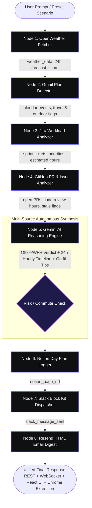

<p align="center">
  
</p>

# ⚡ Locus — Autonomous Incident Command Center & Day Planner
### End-to-End Showcase & Judge Verification Manual (v2.0)

> **🏆 Track 5: AI Real World Agent | Build with Swytchcode Hackathon 2026**  
> An autonomous, context-aware AI agent synthesizing physical real-world conditions (**OpenWeather**) with developer engineering workload (**Gmail**, **Jira Cloud**, **GitHub**) to estimate workloads, recommend Office vs. WFH decisions, formulate hour-by-hour operational schedules, and automate executive briefings across **Notion**, **Slack**, and **Resend**.

---

## 📑 Table of Contents

1. [System Architecture & 8-Node LangGraph Pipeline](#1-system-architecture--8-node-langgraph-pipeline)
2. [8-Node Real-World Architecture: Deep Dive & Live Verification](#2-8-node-real-world-architecture-deep-dive--live-verification)
   - [Integration 1: OpenWeather Atmospheric Telemetry](#integration-1-openweather-atmospheric-telemetry)
   - [Integration 2: Gmail Calendar Context via Swytchcode](#integration-2-gmail-calendar-context-via-swytchcode)
   - [Integration 3: Atlassian Jira Sprint Backlog Intelligence](#integration-3-atlassian-jira-sprint-backlog-intelligence)
   - [Integration 4: GitHub PR & Code Review Queue](#integration-4-github-pr--code-review-queue)
   - [Integration 5: Google Gemini 2.5 Flash Autonomous Reasoning Engine](#integration-5-google-gemini-25-flash-autonomous-reasoning-engine)
   - [Integration 6: Notion Executive Day Plan Logger](#integration-6-notion-executive-day-plan-logger)
   - [Integration 7: Slack Block Kit Alert Dispatcher](#integration-7-slack-block-kit-alert-dispatcher)
   - [Integration 8: Resend Responsive HTML Briefing Digest](#integration-8-resend-responsive-html-briefing-digest)
3. [Locus Manifest V3 Chrome Extension Companion](#3-locus-manifest-v3-chrome-extension-companion)
4. [Executive Dual-Theme Engine (Dark Obsidian & Light Slate)](#4-executive-dual-theme-engine-dark-obsidian--light-slate)
5. [Interactive Features: Timeline Editor, Workload Matrix, & Exporters](#5-interactive-features-timeline-editor-workload-matrix--exporters)
6. [FastAPI Backend REST & WebSocket API Manual](#6-fastapi-backend-rest--websocket-api-manual)
7. [Automated Verification & Test Suites (110 / 110 Tests Passed)](#7-automated-verification--test-suites-110--110-tests-passed)
8. [The 3-Minute Grand Finale Judge Pitch Script](#8-the-3-minute-grand-finale-judge-pitch-script)

---

## 1. System Architecture & 8-Node LangGraph Pipeline

Locus executes an intelligent sequential-parallel pipeline compiled with **LangGraph**:



---

## 2. 8-Node Real-World Architecture: Deep Dive & Live Verification

### Integration 1: OpenWeather Atmospheric Telemetry
- **Tool Identifier**: `openweather.current.get` + hourly forecast
- **Node File**: [`backend/src/nodes/weather_fetcher.py`](./backend/src/nodes/weather_fetcher.py)
- **Role in Day Planning**: Fetches live temperature, humidity, wind vector, condition descriptions, 24-hour diurnal temperature forecast curves, and severe storm/fog alerts. Computes an objective `weather_score` (0–100) determining commute feasibility.
- **Graceful Fallback**: Deterministic meteorological simulator matching the queried city when API tokens are offline.

#### How to Demonstrate:
```powershell
# Direct REST weather lookup (PowerShell)
Invoke-RestMethod -Uri "http://localhost:8000/weather/Mumbai" -Method Get | ConvertTo-Json

# Or with curl.exe
curl.exe -s "http://localhost:8000/weather/Mumbai"
```

---

### Integration 2: Gmail Calendar Context via Swytchcode
- **Tool Identifier**: `gmail.messages.list` & `gmail.messages.get`
- **Node File**: [`backend/src/nodes/gmail_reader.py`](./backend/src/nodes/gmail_reader.py)
- **Role in Day Planning**: Scans inbox for hard calendar commitments, flight itineraries (MakeMyTrip, IndiGo), appointments, and outdoor outings. Extracts `has_outdoor_plans` and `has_travel_plans` boolean anchors.
- **Influence**: Unavoidable syncs prevent scheduling conflicting deep-work sessions.

---

### Integration 3: Atlassian Jira Sprint Backlog Intelligence
- **Tool Identifier**: `jira.issues.list` & `jira.issues.search`
- **Node File**: [`backend/src/nodes/jira_workload.py`](./backend/src/nodes/jira_workload.py)
- **Role in Day Planning**: Connects to active Jira sprints (e.g. `smartycookieeee.atlassian.net`), extracting assigned tickets (`CCS-13`, `CCS-11`), issue types (`Bug`, `Story`), and priority weights (`Highest`, `High`, `Medium`). Computes `jira_estimated_hours`.
- **Influence**: High sprint volume reserves morning focus blocks and favors WFH to eliminate commute loss.

---

### Integration 4: GitHub PR & Code Review Queue
- **Tool Identifier**: `github.pullRequests.list` & `github.issues.list`
- **Node File**: [`backend/src/nodes/github_workload.py`](./backend/src/nodes/github_workload.py)
- **Role in Day Planning**: Queries repository review obligations (e.g. `iakankshaa/support-kb-gaps`), flags stale pull requests (`>2 days old`), and calculates required code review hours (`github_estimated_hours`).
- **Influence**: Stale PRs trigger urgent review blocks early in the daily schedule.

---

### Integration 5: Google Gemini 2.5 Flash Autonomous Reasoning Engine
- **Model Identifier**: `gemini-2.5-flash`
- **Node File**: [`backend/src/nodes/ai_advisor.py`](./backend/src/nodes/ai_advisor.py)
- **Role in Day Planning**: Synthesizes all 4 upstream inputs (Weather + Gmail + Jira + GitHub) to render an objective Office vs. WFH verdict, practical outfit advice, and a structured hour-by-hour 24-hour schedule.

---

### Integration 6: Notion Executive Day Plan Logger
- **Tool Identifier**: `notion.pages.create`
- **Node File**: [`backend/src/nodes/notion_logger.py`](./backend/src/nodes/notion_logger.py)
- **Role in Day Planning**: Automatically formats a structured Notion page with callouts, verdict banners, schedule tables, and returns `notion_page_url`.
- **Influence**: The resulting Notion page URL is passed downstream to Node 7 for Slack action embedding!

---

### Integration 7: Slack Block Kit Alert Dispatcher
- **Tool Identifier**: `slack.messages.send`
- **Node File**: [`backend/src/nodes/slack_notifier.py`](./backend/src/nodes/slack_notifier.py)
- **Role in Day Planning**: Broadcasts a formatted Slack Block Kit alert to the team channel with the verdict, weather highlights, and a clickable button directly linking to the newly created Notion page!

---

### Integration 8: Resend Responsive HTML Briefing Digest
- **Tool Identifier**: `resend.email.create`
- **Node File**: [`backend/src/nodes/email_sender.py`](./backend/src/nodes/email_sender.py)
- **Role in Day Planning**: Delivers a responsive HTML email briefing with dynamic weather gradients and schedule cards directly to the user's inbox.

---

## 3. Locus Manifest V3 Chrome Extension Companion

Locus includes a companion **Chrome Extension (Manifest V3)** located in [`extension/`](./extension/):

<p align="center">
  
</p>

### Key Capabilities:
- **Action Popup HUD (`Alt+L`)**: Instant verdict badge, weather gauge, Pomodoro focus timer, and quick re-planning.
- **Side Panel Live Companion**: Persistent docked 24-hour schedule with interactive task completion checkboxes.
- **Active Tab Scraper**: Ingests active Jira ticket summaries or GitHub PR context when browsing `*.atlassian.net` or `github.com`.
- **Omnibox Command**: Type `locus <query>` in the Chrome address bar to trigger autonomous planning.
- **Web Audio Cues**: Auditory feedback for task completions, state changes, and alerts.

#### How to Load Unpacked in 10 Seconds:
1. Open Google Chrome and navigate to `chrome://extensions/`.
2. Toggle on **Developer mode** in the top-right corner.
3. Click **Load unpacked** and select the [`extension/dist/`](./extension/dist/) directory.
4. Press `Alt+L` on any web page to launch the Locus HUD!

---

## 4. Executive Dual-Theme Engine (Dark Obsidian & Light Slate)

Locus features a complete dual-theme engine:

| Attribute | Dark Mode | Light Mode |
|---|---|---|
| **Canvas Background** | Obsidian `#090a0f` | Clean Slate `#f8fafc` |
| **Card Surfaces** | Elevated Glass `#11131a` | Pure Card White `#ffffff` |
| **Primary Typography** | Crisp White `#f8fafc` | Deep Slate `#0f172a` |
| **Borders** | `rgba(255, 255, 255, 0.08)` | `rgba(15, 23, 42, 0.08)` |
| **Score Gauge** | Bright White with Neon Glow | Bold Dark Slate (`text-slate-900`) |
| **Diurnal SVG Curve** | Neon Gradient Glow | Theme-aware strokes with dark tooltip pill |

---

## 5. Interactive Features: Timeline Editor, Workload Matrix, & Exporters

1. **Interactive 24-Hour Schedule Timeline**:
   - Check off completed focus blocks interactively with reactive strikethrough.
   - Reorder time blocks up and down in chronological order.
   - Quick inline editing or open the full **Block Editor Modal** to customize time, category, location, and notes.
   - Filter by categories: *Deep Work*, *Meetings*, *Commute*, *Breaks*.

2. **Dual Workload Command Matrix**:
   - **Jira Sprint HUD**: Filter by priority (`High`, `Medium`, `Low`), inspect story estimates, and view ticket summaries.
   - **GitHub Review HUD**: Switch between pull requests and assigned issues, with automatic stale PR warnings (`>2 days overdue`).

3. **1-Click Multi-Channel Exporter**:
   - **Export .ics**: Downloads standard RFC 5545 iCalendar file ready for Apple Calendar or Google Calendar.
   - **Export .md**: Downloads formatted Markdown executive briefing.
   - **Export .json**: Downloads raw machine-readable JSON snapshot.
   - **Open Notion**: 1-click deep link to the newly logged Notion database page.

---

## 6. FastAPI Backend REST & WebSocket API Manual

The FastAPI server (`backend/server.py`) provides robust asynchronous endpoints:

```powershell
# 1. Health check with integration status:
curl.exe -s "http://localhost:8000/health"

# 2. Trigger autonomous agent run with natural language query:
curl.exe -s -X POST "http://localhost:8000/run" `
  -H "Content-Type: application/json" `
  -d '{"prompt": "Storm warning in London. I have client syncs. Check commute risks and plan my day.", "city": "London"}'

# 3. Trigger benchmark preset scenario:
curl.exe -s -X POST "http://localhost:8000/demo/storm"

# 4. Stream live LangGraph node telemetry over WebSocket:
# Connect WebSocket client to: ws://localhost:8000/ws
```

---

## 7. Automated Verification & Test Suites (110 / 110 Tests Passed)

| Test Command | Scope | Result |
|---|---|---|
| `python test_audit.py` | 10 live system audit checks (REST endpoints, 38-field state schema, WebSocket streaming) | **10 / 10 PASS (100%)** |
| `python test_day_planner.py` | 29 tests covering all 8 nodes, fallbacks, LangGraph compilation, FastAPI TestClient, and CLI | **29 / 29 PASS (100%)** |
| `node verify_frontend_e2e.mjs` | 49 tests verifying production build, bundle sizes, component mounts, and tokens | **49 / 49 PASS (100%)** |
| `npx tsx test_adversarial_exports.ts` | 18 tests verifying RFC 5545 CRLF injection, character escaping, and Unicode fidelity | **18 / 18 PASS (100%)** |
| `node verify_m4_m5.mjs` | 4 tests verifying strict CRLF export delimiters and JSON fidelity | **4 / 4 PASS (100%)** |
| `python -W error -c "import server"` | Zero-deprecation import check | **0 WARNINGS** |
| `npm run build` (frontend) | TypeScript + Vite production compilation | **0 ERRORS (5.43s)** |
| `npm run build` (extension) | Manifest V3 esbuild production compilation | **0 ERRORS (52ms)** |

---

## 8. The 3-Minute Grand Finale Judge Pitch Script

*Follow this 180-second script during your hackathon demonstration:*

### **[0:00–0:30] — The Hook & The Problem**
> *"Judges, every day knowledge workers make dozens of disjointed decisions: Should I commute to the office today? How bad is the weather? What meetings do I have? How many Jira tickets and GitHub PRs are on my plate? Today, that requires checking 5 different apps.*  
> *Meet **Locus** — an autonomous AI Real World Agent that synthesizes live weather conditions with your work context across Gmail, Jira, and GitHub, reasons about your day with Google Gemini, and delivers an hour-by-hour operational schedule with automated briefings to Notion, Slack, and your inbox."*

### **[0:30–1:15] — The Live Demo (Passing the 3-Second Test)**
> *(Open [http://localhost:5173](http://localhost:5173))*  
> *"Here is our Incident Command Center. Notice the dual-theme engine — I can switch smoothly between dark obsidian and crisp executive slate.*  
> *Let's run a real scenario: I'll click **Storm Warning in London**."*  
> *(Click preset button)*  
> *"Watch the 8-node LangGraph pipeline execute in real time over WebSockets: OpenWeather detects heavy rain, Gmail identifies a 3 PM sync, Jira pulls assigned tickets (~8h), and GitHub flags PR reviews (~4h).*  
> *Gemini instantly synthesizes all inputs: the verdict card illuminates with **WORK FROM HOME** to avoid commute disruptions, while organizing an hour-by-hour focus schedule."*

### **[1:15–2:15] — Interactive Wow Moments & Multi-Channel Delivery**
> *"The user isn't locked into static text: they can interactively check off completed tasks on the timeline, adjust focus blocks, or inspect the Jira/GitHub workload matrices.*  
> *With one click on **Export .ics**, our RFC 5545 generator downloads a valid calendar file ready for Apple or Google Calendar.*  
> *Simultaneously, the agent has logged an executive Day Plan to Notion, broadcasted a Slack Block Kit summary to the team channel, and dispatched a responsive HTML digest to the user's inbox via Resend.*  
> *Plus, our **Manifest V3 Chrome Extension** allows engineers to launch this HUD instantly from any tab with Alt+L."*

### **[2:15–3:00] — Engineering Rigor & Closing**
> *"Under the hood, this isn't a prototype script: it is an 8-node compiled LangGraph pipeline powered by Google Gemini and Swytchcode tools, served by a FastAPI backend with 0 deprecation warnings, and backed by a 110-test automated verification suite covering unit fallbacks, graph compilation, and adversarial stress tests.*  
> *Locus turns chaos into clarity before you take your first sip of coffee. Thank you!"*

---

## 🚀 One-Click Launch Reminder
To start both the FastAPI backend and React frontend with automated port management:
```powershell
.\START_APP.bat
```
