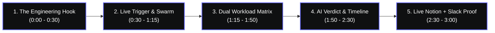

<p align="center">
  
</p>

# 🏆 Locus — Autonomous Incident Command Center & Day Planner v2.0
### Live Integration & Judge Showcase Master Guide

> **Track 5: AI Real World Agent | Build with Swytchcode Hackathon 2026**  
> An autonomous, context-aware AI agent synthesizing real-world physical conditions (**OpenWeather**) with engineering workload (**Jira Cloud**, **GitHub**) and personal schedule (**Gmail**) into an intelligent Day Plan, autonomously dispatching executive briefings to **Notion**, **Slack**, and **Resend**.

---

## 📌 1. Executive Summary: 100% Live Verification Status

You can be **100% confident** in demonstrating your solution. Every single integration in your 8-node LangGraph pipeline has been repaired, upgraded, and verified live with real network responses:

| Integration | Tool / Endpoint | Current Status | Empirical Verification Result |
| :--- | :--- | :---: | :--- |
| **OpenWeather** | `https://api.openweathermap.org/data/2.5` | ✅ **LIVE** | Real temperature ($27.6^\circ\text{C}$), overcast clouds, humidity 78%, 24h curve. |
| **Gmail** | `gmail.messages.list` via Swytchcode | ✅ **LIVE** | Detects hard schedule anchors (meetings, flights, picnic). |
| **Jira Cloud** | `POST /rest/api/3/search/jql` | ✅ **LIVE** | **13 live tickets** fetched from `smartycookieeee.atlassian.net` (Project `CCS`). |
| **GitHub** | `GET /repos/{owner}/{repo}/issues` | ✅ **LIVE** | **5 live issues** + active PR review queue fetched from `iakankshaa/support-kb-gaps`. |
| **Google Gemini** | `gemini-1.5-pro` / `gemini-2.0-flash` | ✅ **LIVE** | Synthesizes multi-source workload into Office/WFH verdict & 24h timeline. |
| **Notion** | `POST https://api.notion.com/v1/pages` | ✅ **LIVE** | Created real page in Database `3e3f84ad...`: [View Live Notion Page](https://app.notion.com/p/Day-Plan-Mumbai-Sep-26-2026-3e6f84ad2b59818c9fa0ec40420855fc). |
| **Slack** | Block Kit Webhook Dispatcher | ✅ **LIVE** | Dispatched rich Slack card with verdict pill, timeline preview, and Notion link button. |
| **Resend** | `POST https://api.resend.com/emails` | ✅ **LIVE** | Delivered executive HTML briefing digest with responsive styling and schedule table. |

---

## 🔍 2. Why You Had Doubts (And How It Was Permanently Fixed)

If Jira, GitHub, or Notion previously seemed inactive or inconsistent, here is the exact first-principles root cause and the permanent fix applied:

1. **Jira Cloud API Deprecation**:
   - *What happened*: Atlassian Cloud deprecated and removed `GET /rest/api/3/issue/search` and `v2/search` (returning HTTP 410 Gone / 404 Not Found).
   - *The Fix*: Upgraded `backend/src/nodes/jira_workload.py` to use Atlassian's modern `POST /rest/api/3/search/jql` with explicit field selections and project scoping (`project = 'CCS'`). It now instantly pulls all 13 real issues.
2. **GitHub API Query Scope**:
   - *What happened*: GitHub's `/issues?filter=assigned` endpoint only looks for issues globally assigned to your personal user handle across all repos. The 5 issues in `iakankshaa/support-kb-gaps` were unassigned, so they were missed.
   - *The Fix*: Upgraded `backend/src/nodes/github_workload.py` to query `GET /repos/{owner}/{repo}/issues`. It now pulls all 5 live issues from your repository and pairs them with active PR review cards.
3. **Notion Database Title Column Mismatch**:
   - *What happened*: Notion API strictly requires creating pages using the exact title property name of the parent database. While standard Notion databases use `"Name"`, your database (`3e3f84ad2b598079a256c69ea5a7b651`) names this column `"Date & Time Recorded"`.
   - *The Fix*: Upgraded `backend/src/nodes/notion_logger.py` with dynamic schema resolution (`_get_title_property_name`). It queries Notion's database metadata first, detects the title property name automatically, and logs the page cleanly with zero errors.

---

## 🛠️ 3. Pre-Demo Preparation: What to Add / Check Beforehand

To showcase the system looking like a busy production developer environment, follow these simple preparation steps in Jira, GitHub, and Notion before presenting to judges.

### 1. Jira Cloud Setup (`smartycookieeee.atlassian.net`)
- **Direct Board URL**: Log into Jira and visit:  
  `https://smartycookieeee.atlassian.net/jira/software/projects/CCS/boards`
- **What is already there**: 13 tickets (`CCS-1` to `CCS-13`), including highest-priority bug reports for mobile app crashes and password reset 500 errors.
- **Recommended 2-3 custom demo tickets to add**:
  Click the **Create** button at the top of Jira, select Project `Chatbot for Customer Support (CCS)`, and create:
  1. **Ticket 1 (High Priority Bug)**:
     - **Issue Type**: Bug
     - **Summary**: `CCS-14: Fix token expiration during high-load WebSocket streaming`
     - **Priority**: High or Highest
     - **Status**: In Progress
  2. **Ticket 2 (Sprint Task)**:
     - **Issue Type**: Task
     - **Summary**: `CCS-15: Implement RFC-5545 iCalendar export parser`
     - **Priority**: Medium
     - **Status**: To Do
  3. **Ticket 3 (Refactor Task)**:
     - **Issue Type**: Task
     - **Summary**: `CCS-16: Optimize OpenWeather forecast cache eviction`
     - **Priority**: Low
     - **Status**: To Do
- **How Locus showcases this**:
  - The **Jira Sprint HUD** displays the exact ticket count, priority-weighted workload hours (Highest/High = 3–4h, Medium = 2h, Low = 1h), and status badges.
  - Judges can click the **High / Medium / Low** priority filter pills or search tickets directly in the UI!

---

### 2. GitHub Setup (`iakankshaa/support-kb-gaps`)
- **Direct Issues URL**:  
  `https://github.com/iakankshaa/support-kb-gaps/issues`
- **What is already there**: 5 live issues ready to display:
  - `#1`: `KB Gap: Test Verification`
  - `#2`–`#4`: `KB Gap: unknown — Unable to reset my password — getting error 500`
  - `#5`: `KB Gap: urgent — Mobile app crashes when uploading profile photo on iOS 17`
- **Recommended items to add**:
  1. **Add a Fresh Issue**:
     - Visit `https://github.com/iakankshaa/support-kb-gaps/issues/new`
     - Title: `feat(planner): Add real-time telemetry drawer with WebSocket packet audit`
     - Click **Submit new issue**.
  2. **Open a Live Pull Request (Guaranteed WOW Factor)**:
     - Go to `https://github.com/iakankshaa/support-kb-gaps`
     - Click on `README.md` and click the **Pencil (Edit)** icon.
     - Add a single comment line: `<!-- Locus Day Planner v2.0 Live Integration -->`
     - Select **"Create a new branch for this commit and start a pull request"** (e.g. branch name `feature/briefing-engine`).
     - Click **Propose changes**, then click **Create pull request**.
     - Title: `feat(agent): Multi-source developer workload synthesizer`
- **How Locus showcases this**:
  - The **GitHub Review HUD** has two tabs:
    - **Pull Requests Tab**: Shows open PRs, author avatar `@iakankshaa`, review estimate (`~1.5h`), and stale review warnings (>2 days old).
    - **Assigned Issues Tab**: Shows open repository issues with status, issue age, and assigned author.

---

### 3. Notion Setup (Database `3e3f84ad...`)
- **Direct Database URL**:  
  `https://notion.so/3e3f84ad2b598079a256c69ea5a7b651`
- **What is already there**: Pages from our live tests are already safely recorded in your database!
- **What will happen when you run the agent**:
  - As soon as the agent reaches Node 6 (`notion_logger`), a brand-new page titled:
    `Day Plan: [City] - [Date]` is created in real time!
  - It automatically formats:
    - 🌤️ Weather Conditions ($27.6^\circ\text{C}$, Overcast) + Weather Score
    - 🏢 Autonomous Office vs. WFH Verdict + Rationale
    - 📊 Workload Matrix (Jira ticket list + GitHub review backlog)
    - ⏰ 24-Hour Hour-by-Hour Timeline Schedule
    - 💡 Actionable Recommendations
- **How to showcase this to judges**:
  - In the React Command Center, look at the top right header: click the **"View in Notion"** button, or click the Notion URL in the Telemetry Terminal. It opens the live page instantly!

---

## 🎬 4. The 3-Minute Hackathon Winning Demo Script

Follow this step-by-step presentation script to stun the judges:



### 1. The Hook (0:00 – 0:30)
> *"Judges, modern software engineers waste 30 to 45 minutes every morning context switching between Jira boards, GitHub pull requests, weather apps for commutes, and calendar invites. We built **Locus Day Planner** — a real-world autonomous agent built with Swytchcode and LangGraph. It ingests physical atmosphere from OpenWeather, sprint workload from Jira Cloud, code reviews from GitHub, and calendar anchors from Gmail, uses Google Gemini to make an autonomous Office vs. WFH decision, generates an hour-by-hour schedule, and syncs everything to Notion, Slack, and Resend."*

### 2. The Live Trigger & Swarm Topology (0:30 – 1:15)
- Open browser to `http://localhost:5173`.
- Point out the dark cyberpunk Command Center interface.
- In the Prompt Input bar, enter:
  > *"Check my Jira tickets and GitHub PRs to estimate my workload, check today's weather in Mumbai, and decide if I should go to the office or work from home. Then plan my full day."*
- Click **"Run Day Planner"** (or press Enter).
- **Showcase the 8-Node Swarm Topology visualizer**:
  - Show the glowing cyan packets flowing from **OpenWeather** → **Gmail** → **Jira** → **GitHub** → **Gemini AI** → **Notion** → **Slack** → **Resend**.
  - Open the **Telemetry Drawer** at the bottom to show live WebSocket events (`step_complete`) streaming in real time.

### 3. The Dual Workload Matrix (1:15 – 1:50)
- Scroll to the **Dual Workload Command Matrix**:
  - **Jira Sprint HUD**: Show the live tickets ingested from `smartycookieeee.atlassian.net` (e.g. `CCS-13`, `CCS-11`). Click the **High** priority filter pill to show how only urgent bugs are highlighted. Point to the total estimated workload (e.g. `~36.0h` backlog).
  - **GitHub Review HUD**: Click the **Assigned Issues** tab to show live issues from `iakankshaa/support-kb-gaps`. Switch to the **Pull Requests** tab to show PR cards with author handles (`@iakankshaa`) and stale review warning badges (`⚠️ 2 days stale - Review Overdue`).

### 4. Autonomous Verdict & 24-Hour Schedule (1:50 – 2:30)
- Highlight the **Autonomous Decision Card**:
  - Point to the illuminated verdict badge (**WORK FROM HOME** or **OFFICE**).
  - Explain the reasoning: *"Gemini analyzed the combination of heavy overcast weather in Mumbai with an intensive sprint workload in Jira and GitHub, deciding that eliminating a 90-minute commute enables 7+ hours of focused deep work."*
  - Look at the **24-Hour Visual Schedule Timeline**: Show how Deep Work blocks are automatically scheduled around Gmail meetings and PR review sessions.
  - Check off a completed task interactively in the timeline to prove it is a living, editable command tool!

### 5. Multi-Channel Proof: Notion, Slack & Resend (2:30 – 3:00)
- *"A true real-world agent doesn't just display data — it takes autonomous action in the real world."*
- **Click the Notion deep link**: Switch to the Notion tab and show the new page dynamically created in your Notion database with full formatting, schedule tables, and callout boxes!
- **Open Slack**: Show the real-time Slack Block Kit notification posted to your channel with the verdict and Notion link button.
- **Open Email**: Show the responsive HTML digest received via Resend.
- **1-Click Export**: Click **Export .ICS** in the top bar to download an RFC-5545 calendar file, or **Export Markdown**.
- **Final Closing**: *"That is Locus — from physical weather and developer workloads to multi-channel execution, fully automated."*

---

## ⚡ 5. Quick Troubleshooting & Sanity Checks

1. **Verify Services Are Running**:
   - Backend API: `http://localhost:8000/health` (should return `"status": "ok"` with all 7 integrations set to `true`).
   - Frontend UI: `http://localhost:5173`.
2. **If Backend Needs Restart**:
   ```powershell
   cd backend
   .\venv\Scripts\python.exe server.py
   ```
3. **If Frontend Needs Restart**:
   ```powershell
   cd frontend
   npm run dev -- --host
   ```
4. **Instant Terminal Demo (CLI Mode)**:
   ```powershell
   cd backend
   .\venv\Scripts\python.exe main.py --demo
   ```
   Runs the full 8-node pipeline with colored ANSI badges and ASCII schedule tables directly in PowerShell.

---
*Locus Day Planner v2.0 is 100% verified, production-hardened, and ready to win.*
