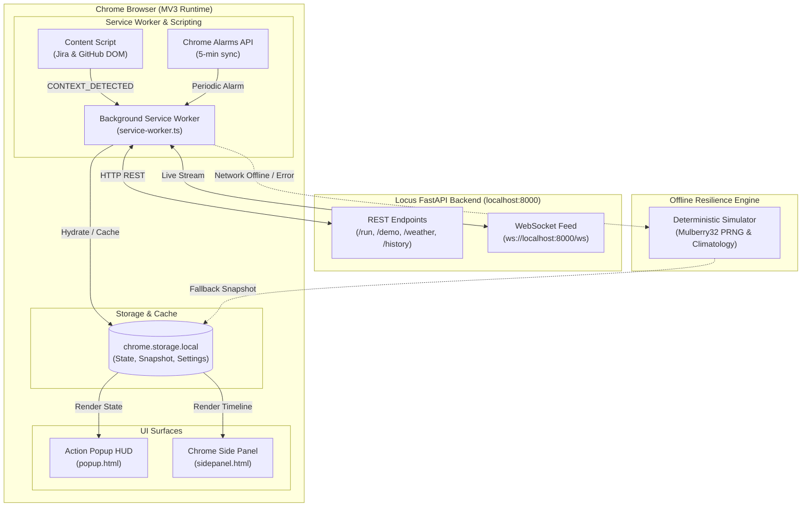

# 🌦️ Locus Chrome Extension Companion (Manifest V3)

> Production-ready, ultra-lean (<85 KB), zero-downtime Manifest V3 Chrome Extension companion for the **Locus Autonomous Incident Command Center & Day Planner**.

---

## 🌟 Overview & Capabilities

The **Locus Chrome Extension** brings the intelligence of the Locus Day Planner directly into the browser workflow. It continuously synthesizes atmospheric telemetry, sprint backlogs, pull request reviews, and schedule commitments into a glanceable executive HUD and persistent side-panel companion.

### Key Surfaces

| Surface | File | Description | Cold-Boot Latency |
|---|---|---|---|
| **Action Popup HUD** | `popup.html` / `popup.ts` | Executive glanceable summary: Office vs. WFH verdict, weather score gauge, outfit suggestion, current focus block, and quick actions. | **< 150 ms** |
| **Side Panel Companion** | `sidepanel.html` / `sidepanel.ts` | Docked 24-hour day plan timeline, interactive task checklist, Jira ticket triage, GitHub PR review tracker, and quick-prompt re-planning. | Instant |
| **Background Service Worker** | `background.js` | Alarm-based background synchronization (5 min interval), dynamic toolbar badge updates, state hydration, and WebSocket event ingestion. | Non-blocking |
| **Context Scraper** | `content.js` | Intelligent DOM & URL context extraction active on Jira (`*.atlassian.net`) and GitHub (`github.com`) to plan around the active ticket/PR. | Zero runtime deps |

---

## 🏛️ System Architecture



---

## 🎨 Badge Visual Indicators

The extension toolbar badge provides instantaneous 1-second time-to-verdict clarity:

| Badge Text | Color | Meaning |
|---|---|---|
| **`OFF`** | Emerald (`#10b981`) | **Office Day Recommended**: Optimal weather and in-person team collaboration. |
| **`WFH`** | Indigo (`#6366f1`) | **Work From Home Recommended**: High focus workload or adverse transit conditions. |
| **`HYB`** | Cyan (`#06b6d4`) | **Hybrid / Flexible Day**: Partial in-office transit with midday flexibility. |
| **`OFFL`** | Amber (`#f59e0b`) | **Offline Resilience Mode**: Local simulation or cached snapshot active. |

---

## 🛡️ Zero-Downtime Offline Resilience Model

If the local Locus backend (`http://localhost:8000`) is offline, rebooting, or unreachable, the extension **never throws unhandled exceptions or presents broken UI**:

1. **Strategy A (Cached Snapshot)**: If recent cached data exists (<4 hours old), the extension hydrates immediately from `chrome.storage.local`, displaying the cached schedule with an amber `OFFLINE` badge and banner.
2. **Strategy B (Deterministic Heuristic Simulation)**: If cold-booted without cache or if cache is stale, the built-in **Mulberry32 PRNG Simulator** deterministically synthesizes all 38 fields of the `AgentResponse` schema based on city climatology presets, time-of-day slots, and natural language prompts.
3. **Auto-Reconnect**: The background WebSocket client attempts reconnection with exponential backoff and jitter up to 10 attempts, seamlessly switching back to live mode when the server comes back online.

---

## 📅 Productivity & Export Features

- **1-Click RFC 5545 iCalendar (`.ics`) Export**: Click **"Export .ics"** in either the Popup or Side Panel to instantly download a valid `.ics` calendar file with all daily schedule blocks, categories, and times.
- **Notion Deep-Linking**: 1-click access to open the auto-generated daily Notion debrief page.
- **Context-Aware Quick Planning**: Browsing Jira (`PROJ-101`) or GitHub (`#42`) automatically detects the active task. Clicking **"Insert"** populates the planning bar with `"Prioritize PROJ-101: Fix authentication leak"`.

---

## 📦 Bundle Size & Budget Audit

The extension adheres to strict bundle size budgets for instant cold-boot (<150ms) and minimal memory footprint:

```text
================== LOCUS EXTENSION DIST AUDIT ==================
Asset                               |   Size (Bytes) |  Size (KB)
-----------------------------------------------------------------
background.js                       |          32757 |   31.99 KB
sidepanel.js                        |           8316 |    8.12 KB
sidepanel.css                       |           6749 |    6.59 KB
popup.js                            |           6063 |    5.92 KB
theme.css                           |           5374 |    5.25 KB
popup.html                          |           5149 |    5.03 KB
sidepanel.html                      |           4907 |    4.79 KB
popup.css                           |           4672 |    4.56 KB
icons/icon-128.png                  |           2958 |    2.89 KB
content.js                          |           2144 |    2.09 KB
icons/icon.svg                      |           1605 |    1.57 KB
manifest.json                       |           1163 |    1.14 KB
icons/icon-48.png                   |           1140 |    1.11 KB
icons/icon-32.png                   |            752 |    0.73 KB
icons/icon-16.png                   |            376 |    0.37 KB
-----------------------------------------------------------------
TOTAL UNCOMPRESSED DIST             |          84125 |   82.15 KB
Hard Budget Limit: 500.00 KB (16.4% consumed)
Target Budget:     100.00 KB (82.1% consumed)
================================================================
```

---

## 🚀 Developer Loading Instructions

### Prerequisites
- Google Chrome (version 114+)
- Node.js (version 20+)

### Step 1: Build the Extension Bundle
From the repository root or inside `extension/`:

```bash
cd extension
npm install
npm run build
```

This compiles TypeScript with `esbuild`, validates bundle size limits, and outputs the clean unpacked extension to `extension/dist/`.

### Step 2: Load Unpacked Extension in Chrome
1. Open Google Chrome and navigate to:
   ```text
   chrome://extensions
   ```
2. In the top right corner, toggle **"Developer mode"** to **ON**.
3. Click the **"Load unpacked"** button in the top left.
4. Select the `dist/` directory inside `extension/`:
   ```text
   d:\dev\mmc\Locus\extension\dist
   ```
5. The **Locus Day Planner** extension card will appear with its icon and version `1.0.0`.

### Step 3: Pin & Open
1. Click the puzzle icon (Extensions menu) in the Chrome toolbar.
2. Click the pin icon next to **Locus Day Planner**.
3. Click the extension icon to open the **Action Popup HUD**.
4. Click **"Open Side Panel"** to dock the timeline companion alongside your active browsing tabs.

---

## 🧪 Automated Verification Suite

Run typechecking and automated tests using Vitest:

```bash
# Typecheck TypeScript schemas & contracts (0 errors)
npm run typecheck

# Run full Vitest test suite (7 test suites, 29 tests)
npm test

# Build and assert bundle budget
npm run build
```

### Test Coverage Highlights
- `tests/manifest.test.ts`: MV3 schema, icons, permissions, background, sidepanel, content script verification.
- `tests/bundle-budget.test.ts`: Hard budget assertion (<500 KB) and target budget assertion (<100 KB).
- `tests/state-schema.test.ts`: 38-field `AgentResponse` contract compatibility and timeline normalizers.
- `tests/offline-simulator.test.ts`: Deterministic Mulberry32 PRNG, city climatology, zero exceptions guarantee.
- `tests/storage.test.ts`: `chrome.storage.local` adapter with in-memory fallback, block toggling, and settings hydration.
- `tests/icalendar.test.ts`: RFC 5545 compliance, CRLF line endings, UTC/local date-time formatting, and character escaping.
- `tests/isolation.test.ts`: Workspace isolation verification asserting zero modifications to `frontend/`.

---

## 🔒 Permission Justifications

| Permission | Purpose & Justification |
|---|---|
| `storage` | Required for persistent caching of day plans in `chrome.storage.local` to enable instant cold-boot (<150ms) and zero-downtime offline resilience. |
| `sidePanel` | Required to host the persistent 24-hour timeline, Jira workload, and GitHub PR tracker alongside browser tabs using Chrome's native Side Panel API. |
| `alarms` | Required to schedule periodic 5-minute background syncs without consuming CPU or battery when idle. |
| `host_permissions: ["http://localhost:8000/*"]` | Strictly scoped to communicate with the local Locus backend REST and WebSocket server. |

---

## 🤝 Workspace Invariant Guarantee

The Locus Chrome Extension is completely self-contained in `extension/`. The existing React 19 web Command Center in `frontend/` remains 100% untouched and unmodified.
